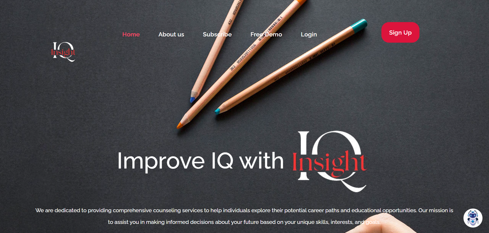
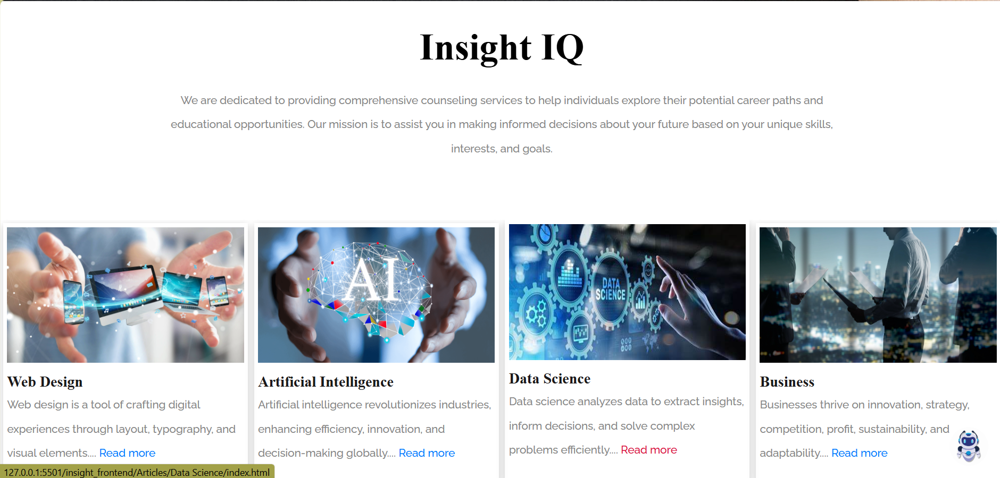
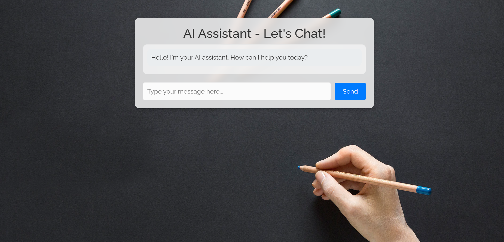
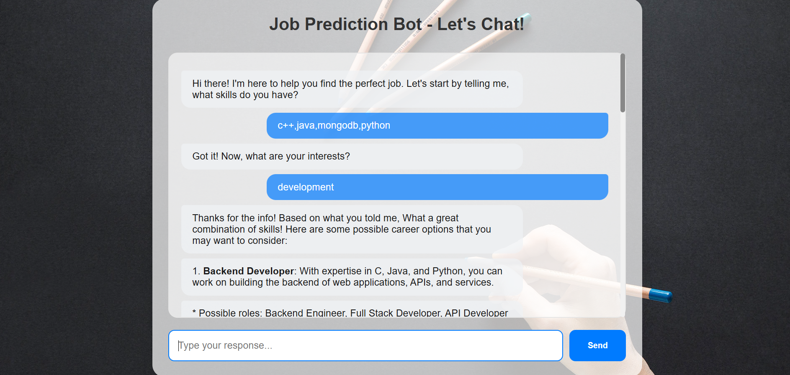
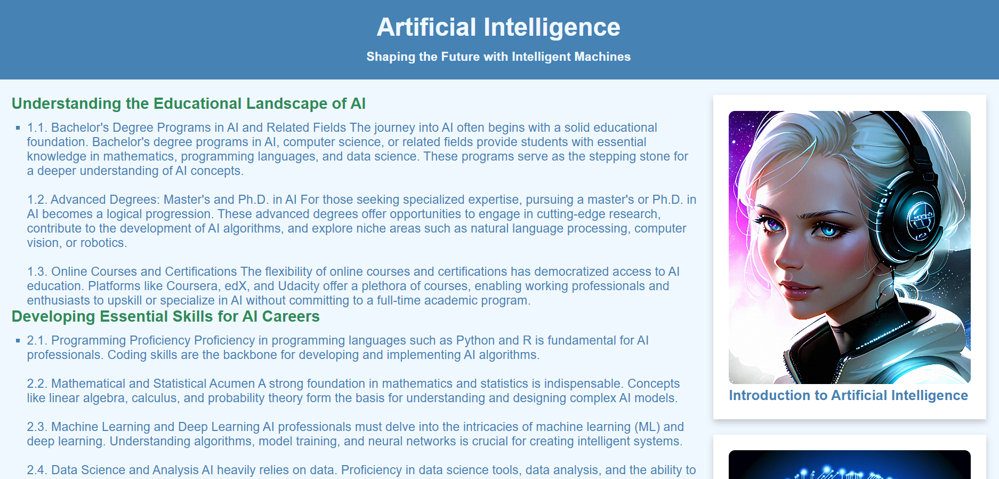
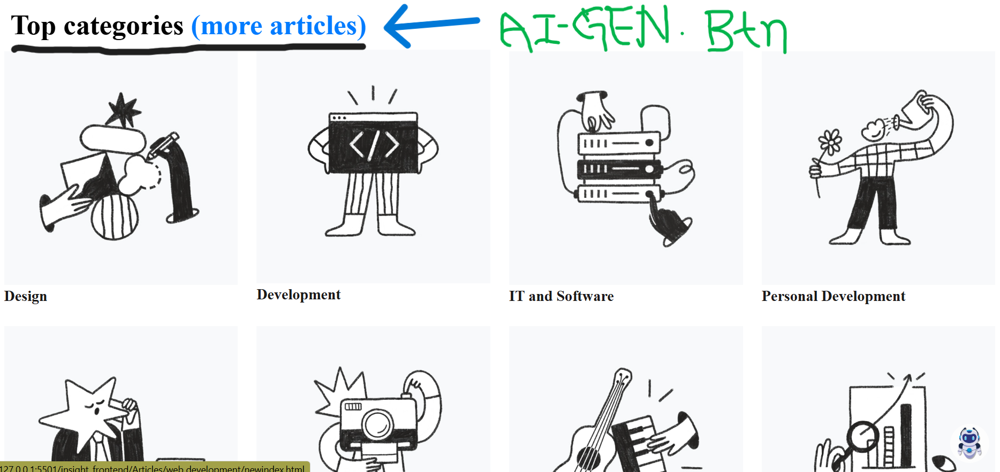
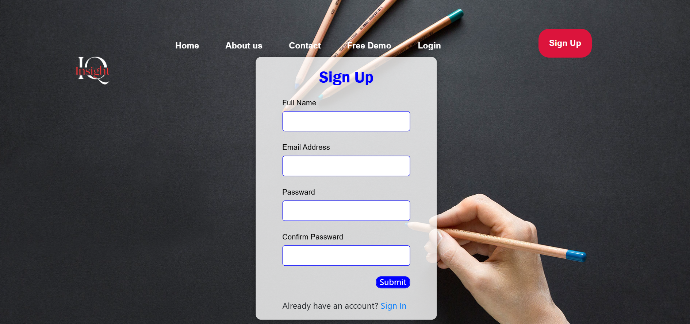
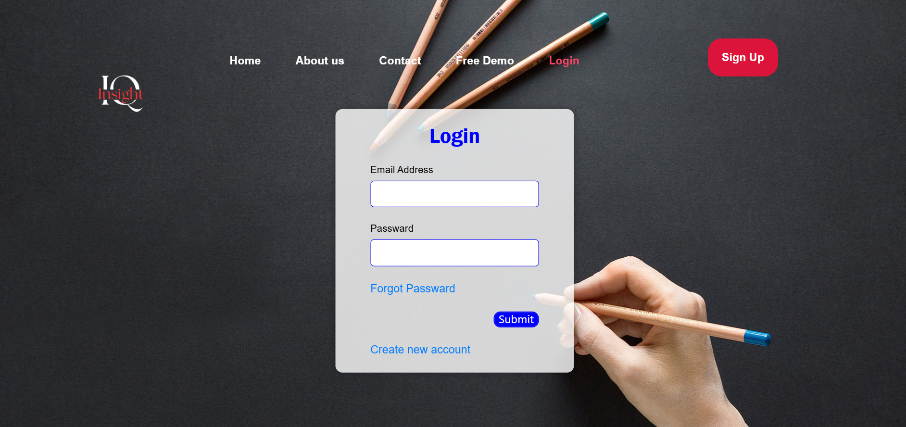

# InsightIQ - AI-driven Career Guidance Platform

## Overview
The **InsightIQ** platform is a Django-based project that integrates frontend and backend separately via APIs. This platform helps users explore career options through AI-generated articles and interact with an OpenAI-powered chatbot. Authenticated users can schedule expert consultations via video or voice calls for a minimal fee. Additionally, an AI model suggests job opportunities based on the user's skill set and interests.

## Getting Started
Follow these steps to set up and run the project locally:

### Prerequisites
- Python
- Django
- PostgreSQL or SQLite
- OpenAI API Key

### Backend Setup (Django)
1. Clone the repository:
   ```sh
   git clone https://github.com/srajan-kush/InsightIQ---AI-driven-Career-Guidance-Platform.git
   cd insightiq-career-platform
   ```
2. Create a virtual environment:
   ```sh
   cd sih_env\Scripts
   ./activate.ps1
   cd..
   cd..
   ```
3. Inside Backend directory:
   ```sh
   cd insight_backend
   ```
4. Apply migrations:
   ```sh
   python manage.py migrate
   ```
5. Run the development server:
   ```sh
   python manage.py runserver
   ```

   
## Frontend Setup

- Navigate to the folder containing index.html in File Explorer.
- Double-click to open in your default browser or right-click → Open with → Select your browser.

## Features

### 1. Career Exploration
- Users can browse articles related to different career options.
- Low-popularity articles are generated using an **AI-powered LLM model**.
- Integrated **OpenAI chatbot** for career-related queries.

### 2. Expert Consultation
- Users can authenticate and schedule a consultation slot with an expert for a minimal fee.
- Supports both **video calls** and **voice chats**.

### 3. AI-driven Job Recommendations
- AI model suggests job opportunities based on the user's skill set and interests.


## Screenshots

### 1. Homepage


### 2. Popular Career Articles


### 3. OpenAI Integrated Chatbot


### 4. Job Recommendations


### 5. LLM Based Articles Gen Model


### 6. A Sample of Article Page


### 7. More Articles And AI-Articles Gen Btn


### 8. Signup Page


### 9. Login Page



## Contributing

Contributions are welcome! Feel free to fork the repository and submit a pull request.

## License

This project is licensed under the **MIT License**.

## Contact

For any inquiries, reach out to **Srajan Kushwaha** at **srajank2003@gmail.com**.


